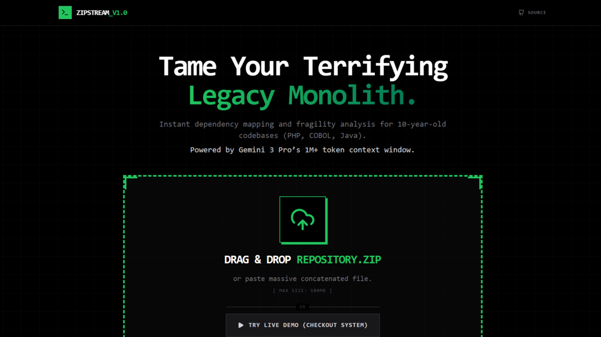

# LegacyLens

> **Tame Your Terrifying Legacy Monolith.**
> Instant dependency mapping and fragility analysis for 10-year-old codebases (PHP, COBOL, Java).
> Powered by **Gemini 1.5 Pro’s 1M+ token context window**.



LegacyLens is a modern visualization tool designed to help developers understand, refactor, and modernize massive, legacy codebases. By leveraging Google's Gemini GenAI, it ingests entire code repositories (drag & drop zip) to reconstruct dependency graphs, identify fragility hotspots, and provide conversational insights—without needing to manually parse archaic syntax.

## 🚀 Features

*   **Whole-Context Ingestion:** Loads your entire architecture into Gemini's 1M+ context window. No chunking, no lost context.
*   **Instant Dependency Mapping:** Automatically reconstructs and visualizes the dependency graph across all files and languages simultaneously.
*   **Fragility Heatmapping:** Identifies "load-bearing" code and critical failure points. Calculates a fragility score (0-10) based on coupling, complexity, and downstream impact.
*   **Language Agnostic:** Supports legacy stacks including PHP, Java 6-8, COBOL, Perl, and Python 2.7.
*   **Interactive Visualization:** Zoom, pan, and explore your codebase's structure using an interactive node-based graph.
*   **Chat with your Code:** Ask questions about specific modules or refactoring strategies directly within the interface.

## 🛠️ Tech Stack

*   **Frontend:** [React 19](https://react.dev/), [Vite](https://vitejs.dev/)
*   **Styling:** [Tailwind CSS](https://tailwindcss.com/)
*   **Visualization:** [React Flow](https://reactflow.dev/)
*   **AI/LLM:** [Google Gemini API](https://ai.google.dev/) (@google/genai)
*   **Icons:** Lucide React
*   **Animations:** Framer Motion

## 📦 Run Locally

**Prerequisites:** Node.js (v18+ recommended)

1.  **Clone the repository:**
    ```bash
    git clone https://github.com/RavaniRoshan/LegacyLens.git
    cd LegacyLens
    ```

2.  **Install dependencies:**
    ```bash
    npm install
    ```

3.  **Configure Environment:**
    Create a `.env.local` file in the root directory and add your Gemini API key:
    ```env
    GEMINI_API_KEY=your_api_key_here
    ```

4.  **Run the app:**
    ```bash
    npm run dev
    ```

5.  **Build for production:**
    ```bash
    npm run build
    ```

## 🌐 AI Studio

View and deploy your app in AI Studio: [https://ai.studio/apps/drive/1DJIodbTqgtPzXJC9JWyWhqknO1tSlsrC](https://ai.studio/apps/drive/1DJIodbTqgtPzXJC9JWyWhqknO1tSlsrC)

---

<div align="center">
  <sub>Built for the Kaggle Competition. &copy; 2025 LegacyLens Inc.</sub>
</div>
